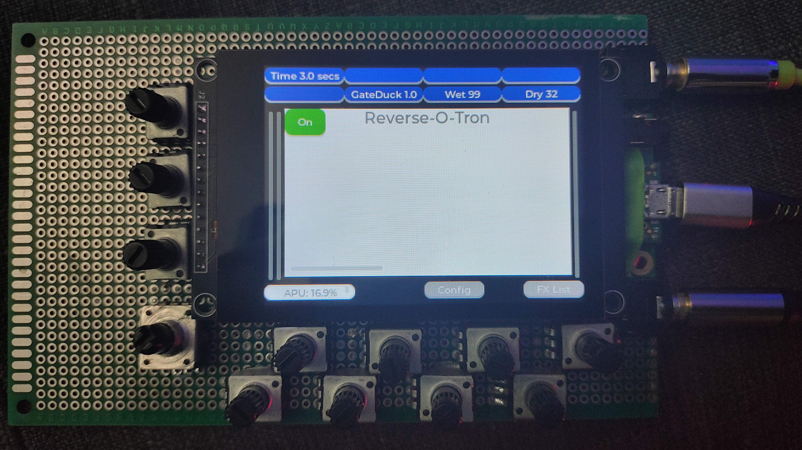

Teensy MultiFX

A simple hardware platform for Gutiar based FX. Mostly mod and delay - no distortion. Audio board has no Hi-Z input, so this is meant to be used after
your main distortion pedal (ToneX-One is what I use).

Libs Used:

- LVGL 9.22, Teensydunio

Libs Planned:

- DRWav,DRFlac,DRMp3 (for media playback)
- Teensy T4 screen lib
- 
Current Status:

- SD card - working and reading.
- Screen Working
- LVGL rendering
- One FX running
- Pots working
- Encoder Working
- USB Audio in and out working

Code style is wildcat frenzy - so a complete mess :) - early days until everything falls into place and refactoring to a neat and tidy system.
Code is un-optimized

Current Parts are:

- Teensy 4.1
- Teensy Aduio Board rev D
- 11x 10k pots
- 1 ALPS rotary encoder
- Hosyond 3.2 inch 240x320 IPS Capacitive Touch Screen LCD Module SPI Serial ILI9341V 
- 128gb SDCard
- 2 Stereo 3.5mm sockets
- 1 PCB board
  

